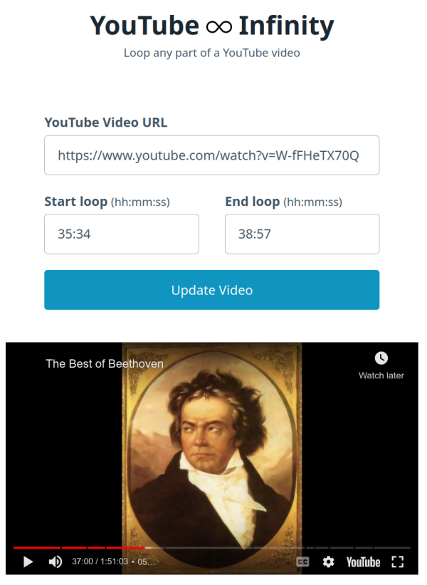

# This is a read-only mirror of the git repo at https://codeberg.org/marc/youtube-infinity

# YouTube Infinity

A simple, zero dependency, client-side web app that allows looping any part of a YouTube video.
YouTube's *IFrame Player API* is used, which does not need any API key.

Features:

- Loop any part of a YouTube video (duh!).
- Automatically creates a personalized link that you can bookmark.
- Always uses YouTube's [privacy-enhanced mode](https://support.google.com/youtube/answer/171780?hl=en#zippy=%2Cturn-on-privacy-enhanced-mode): your `youtube.com` links will automatically be converted to `youtube-nocookie.com`.

**[---> DEMO <---](https://marc.codeberg.page/youtube-infinity/)**

## Screenshot

## License

[AGPL v3](https://codeberg.org/marc/youtube-infinity/src/branch/main/LICENSE)
